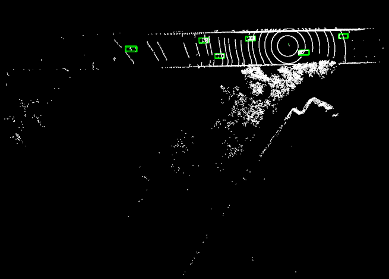
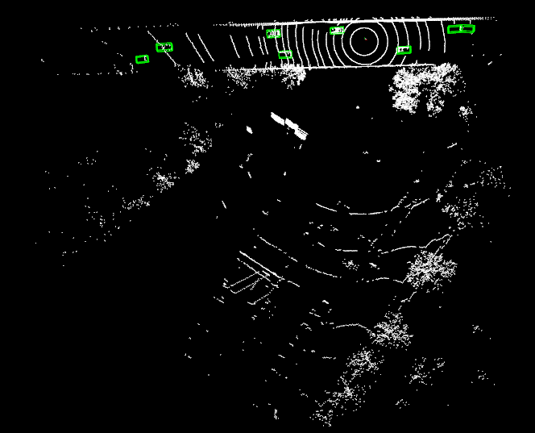

# LiDAR based Object Detection on Custom Data using OpenPCDet

This is a fork of the original repo [OpenPCDet](https://arxiv.org/abs/1812.04244). Contributions include customization of the config files and creation of utility scripts to enable training on Custom Data ([V2V4Real](https://github.com/ucla-mobility/V2V4Real)) using the PV_RCNN model.

## Prerequisite
1. Install OpenPCDet by following the official [installation document](https://github.com/open-mmlab/OpenPCDet/blob/master/docs/INSTALL.md).
2. Read over the [Custom Dataset Tutorial](https://github.com/open-mmlab/OpenPCDet/blob/master/docs/CUSTOM_DATASET_TUTORIAL.md) provided by OpenPCDet.

## 1. Data Preparation
1. Download the V2V4Real Dataset in Kitti format. Details on the dataset can be found [here](https://mobility-lab.seas.ucla.edu/v2v4real/).

    The labels_kitti directory contains the labels of the objects and information about its 3D box coordinate. Here is an example:

    ```
    [
    {
        "obj_id": "1",
        "obj_type": "Car",
        "psr": {
        "position": {
            "x": -20.232923334766838,
            "y": -0.010953035456623184,
            "z": -1.1805384281008844
        },
        "rotation": {
            "x": 0,
            "y": 0,
            "z": 0.07853981633974486
        },
        "scale": {
            "x": 3.9799348184967185,
            "y": 2.0622318234681405,
            "z": 1.6980521556897767
        }
        }
    }
    ]
    ```

2. Convert the .json annotations files into the required format with .txt extension. The new label format should be:
    ```
    # format: [x y z dx dy dz heading_angle category_name]
    1.50 1.46 0.10 5.12 1.85 4.13 1.56 Vehicle
    5.54 0.57 0.41 1.08 0.74 1.95 1.57 Pedestrian
    ```

    For convenience, running the following script will convert all .json files into the .txt files.
    ```
    python myscripts/convert_json_to_txt.py <json_directory>
    ```

3. Split the dataset into training / validations sets. Create a `ImageSets` directory under `/data/custom`. The indicides of the training data should be listed in `train.txt`, and the indices of the validation set should be listed in `val.txt`.

    After running the above steps, the files structure should look like:
    ```
    OpenPCDet
    ├── data
    │   ├── custom
    │   │   │── ImageSets
    │   │   │   │── train.txt
    │   │   │   │── val.txt
    │   │   │── points
    │   │   │   │── 000000.bin
    │   │   │   │── 999999.bin
    │   │   │── labels
    │   │   │   │── 000000.txt
    │   │   │   │── 999999.txt
    ├── pcdet
    ├── tools
    ```

4. Modify the config file. The config file for the custom dataset is at `/tools/cfgs/dataset_configs/custom_dataset.yaml`.

* Modify `POINT_CLOUD_RANGE`: This defines the the minimum and maximum of the data in x, y, z direction in [min_x, min_y, min_z, max_x, max_y, max_z] order. Replace this with known values from the dataset. Otherwise run the following after setting the correct path of the lidar data files. 
    ```
    python myscripts/point_cloud_range.py 
    ````

* Define `CLASS_NAMES` according to your dataset. V2V4Real contains five classes, but only the `Car` class is present in the data used for training (Day 19, testoutput_CAV_data_2022-03-15-09-54-40_0, tesla).

* Define `MAP_CLASS_TO_KITTI`. This defines the mapping between the custom dataset to existing KITTI classes.

* (Important) Define `VOXEL_SIZE`. This parameter can be found under `DATA_PROCESSOR / - NAME: transform_points_to_voxels / VOXEL_SIZE`. For PV-RCNN, the point cloud range and voxel size must satisfy the following in order to avoid dimension mismatch in the model layers.
    1. Point cloud range along z-axis / voxel_size is 40
    2. Point cloud range along x&y-axis / voxel_size is the multiple of 16.

    The final values of `POINT_CLOUD_RANGE` and `VOXEL_SIZE` are:
    ```
    POINT_CLOUD_RANGE: [-128, -128, -17, 128, 8, 15]
    VOXEL_SIZE: [0.1, 0.1, 0.8]
    ```

5. Finally, create the custom_info files by running the following:
    ```
    python -m pcdet.datasets.custom.custom_dataset create_custom_infos tools/cfgs/dataset_configs/custom_dataset.yaml
    ```
## 2. Training
1. Modify the model config file `pv_rcnn.yaml`. This file can be found `tools/cfgs/custom_models/pv_rcnn.yaml`.

* Set the path to the dataset config file.
    ```
    DATA_CONFIG:
        _BASE_CONFIG_: /path/to/OpenPCDet/tools/cfgs/dataset_configs/custom_dataset.yaml
    ```

* Change `CLASS_NAMES`.
    ```
    CLASS_NAMES: ['Car']
    ```

2. Run the train.py script. Batch size has been set to 1 due to GPU memory shortage.
```
python train.py --cfg_file cfgs/custom_models/pv_rcnn.yaml --batch_size 1

```

## 3. Inference
Run the given `demo.py` script to visualize inference results. Put LiDAR files to use for inference at `inference_data`.
```
python tools/demo.py --cfg_file tools/cfgs/custom_models/pv_rcnn.yaml --data_path inference_data/ --ckpt output/custom_models/pv_rcnn/default/ckpt/checkpoint_epoch_80.pth
```
<figure>

<figcaption>Result 1 on untrained data</figcaption>
</figure>

<figure>

<figcaption>Result 2 on untrained data</figcaption>
</figure>
